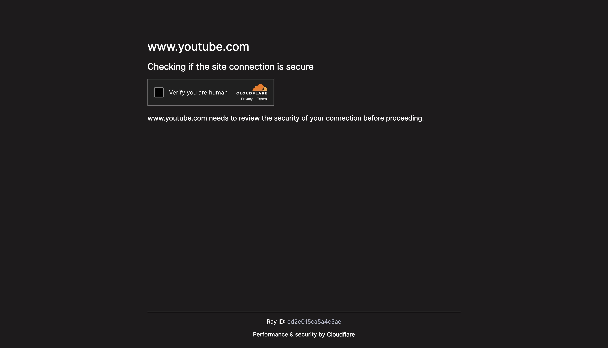

# CAPTCHA Rick Roll
This is a simple website that pretends to be a Cloudflare Turnstyle (similar to a reCAPTCHA) and ask you to verify you are human. Once the verify button is clicked, it redirects you to the Rick Roll.

## What it looks like

## Why?
Many messaging applications, such as Gmail, iMessage, and more give previews of links. If you texted your friend a direct link to the rick roll, or even a shortened URL, it would show them a preview thumbnail and the surprise would be ruined. This page requires the user to manually click a button that sends them to the rickroll.

## How to Use
Just send your friend this link:
[https://estech321.github.io/CAPTCHA-RickRoll/](https://estech321.github.io/CAPTCHA-RickRoll/)
Or, to be less suspicious, use this shortened URL:
[http://tinyurl.com/ywsxwu23](http://tinyurl.com/ywsxwu23)
Here's a video showing how it works: [https://youtu.be/dQw4w9WgXcQ](https://youtu.be/dQw4w9WgXcQ)

## Copyrighting
I am not placing this code under any liscense, especially because it contains other companies' brand names. That means you shouldn't, either. Feel free to fork it, change the code how you like, change the URL that appears onscreen, etc. I just ask you not to claim ownership and for you to mention me in your READMEs.

## Disclaimer
I am not responsible for any trolling people use this for. I do not claim ownership and am not affiliated with Cloudflare, Cloudflare Turnstyle, Google, or reCAPTCHA in any way. All trademarks are property of their respective owners.